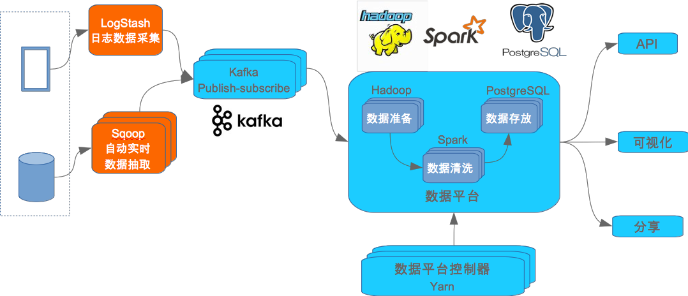
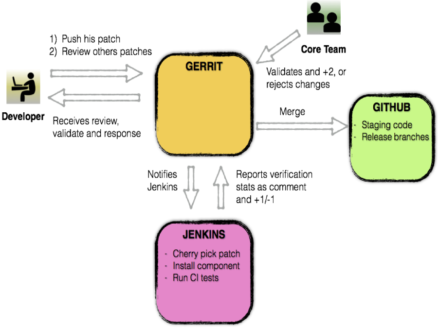
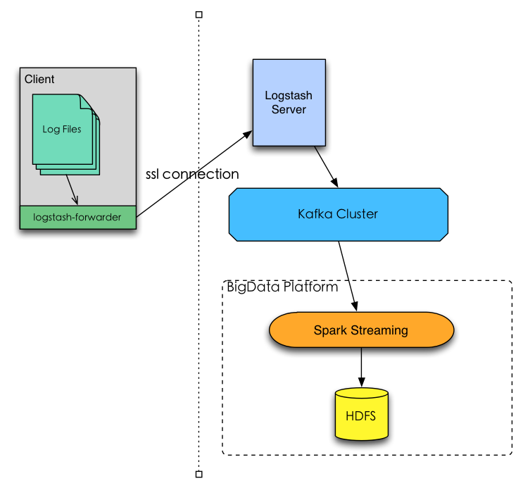
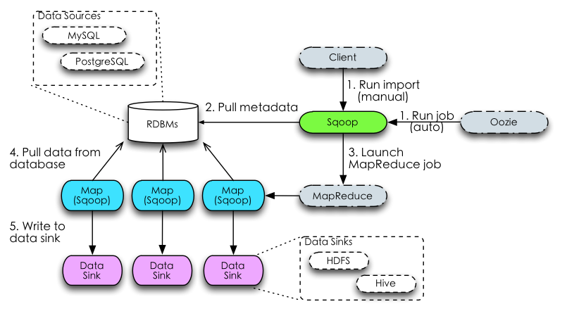

# EL BigData Platform Environment Deployer

## Architecture design

### Data Platform Architecture



### Gerrit Review System



### Log File Connector



### MySQL Database Connector



## Prerequisite

### Hardware and Operating System CentOS 6.7 x86_64

There are 3 disks in machines. 2 are SAS and 1 SCSI 140G), which is used to install operating system -> CentOS 6.7 x86_64. Create volumn group (VG) on 2 SAS disks, in case additional disks added later.

### NTP

Setup NTP server and sync the system clock on all the machines in the environment

- [How to Install and Configure Linux NTP](http://www.thegeekstuff.com/2014/06/linux-ntp-server-client/)  
- [Setup NTP on CentOS in Chinese](http://zh888.blog.51cto.com/1684752/1244772)

### Install and configure the salt-master on Firstbox
  - Install salt master:
```
$ yum install -y epel-release
$ yum install -y salt-master
```

  - Add /etc/salt/master.d/devops.conf on firstbox:

```
file_roots:
  devops:
    - /devops/deployer/salt/roots
pillar_roots:
  devops:
    - /devops/deployer/salt/pillar
fileserver_backend:
  - roots
  - minion
file_recv: True
state_output: terse
autosign_file: /etc/salt/autosign.conf
```

  - Run `salt-master -d`

* Install and configure the salt-minion on clients
```
$ yum install -y epel-release
$ yum install -y salt-minion
```


  - Update the *master* attribute in /etc/salt/minion to point to the firstbox
  - Run `salt-minion -d -l debug`

* Stop iptables on salt-master
```
$service iptables stop
$chkconfig iptables off
$chkconfig --list|grep iptables
```

### Manage authentication key
```
$salt-key -L
$salt-key -A or $salt-key -a #minionid#
```

### Install docker on firstbox
Before the installation starts, you'd setup docker local registry and remove the installed docker package, if there is, on ALL nodes, to avoid version conflict.
```
$ wget https://get.docker.com/rpm/1.7.1/centos-6/RPMS/x86_64/docker-engine-1.7.1-1.el6.x86_64.rpm
$ yum localinstall docker-engine-1.7.1-1.el6.x86_64.rpm
```

* Setup docker registry on firstbox:
```
$ docker run -d -p 5000:5000 \
--restart=always --name docker_repo \
-e SETTINGS_FLAVOR=local \
-e SEARCH_BACKEND=sqlalchemy \
-e SQLALCHEMY_INDEX_DATABASE=sqlite:////var/lib/registry/docker-registry.db \
-e STORAGE_PATH=/var/lib/registry \
-v /data/docker_repo:/var/lib/registry registry
```

* Pull the follewing docker images into the local docker registry:
Note: The docker-registry.$host.com should be reachable or add it into the /etc/hosts.

Docker Hub Image    |  Tage    | Local Registry Image                              | Tag
--------------------|----------|---------------------------------------------------|-------
osixia/phpldapadmin | latest   | docker-registry.$host.com:5000/phpldapadmin     | latest
nickstenning/slapd | latest | docker-registry.$host.com:5000/slapd | latest
sameersbn/postgresql | 9.4-2 | docker-registry.$host.com:5000/postgresql | 9.4-2
sameersbn/redis | latest | docker-registry.$host.com:5000/redis | latest
sameersbn/gitlab | 7.13.0 | docker-registry.$host.com:5000/gitlab | 7.13.0
jenkins | latest | docker-registry.$host.com:5000/jenkins | latest
logstash | 1.5.4-1 | docker-registry.$host.com:5000/logstash | 1.5.4-1

  - Build gerrit image:
```
$ git clone https://github.com/idevops-net/ci.git
$ cd ci/docker/docker-gerrit
$ wget https://gerrit-releases.storage.googleapis.com/gerrit-2.11.2.war
$ docker build -t docker-registry.$host.com:5000/gerrit:0.0.1 --force-rm=true ./
$ docker push docker-registry.$host.com:5000/gerrit:0.0.1
```

Local Registry Image                              | Tag
--------------------------------------------------|-------
docker-registry.$host.com:5000/gerrit           | 0.0.1

  - Build jenkins image:
```
$ cd ci/docker/docker-jenkins
$ wget http://apache.arvixe.com/maven/maven-3/3.3.3/binaries/apache-maven-3.3.3-bin.zip
$ docker build -t docker-registry.$host.com:5000/jenkins:0.0.1 --force-rm=true ./
$ docker push docker-registry.$host.com:5000/jenkins:0.0.1
```

Local Registry Image                              | Tag
--------------------------------------------------|-------
docker-registry.$host.com:5000/jenkins           | 0.0.1

  - Build zookeeper image:
```
$ cd ci/docker/docker-zookeeper
$ docker build -t docker-registry.$host.com:5000/zookeeper:0.0.1 --force-rm=true ./
$ docker push docker-registry.$host.com:5000/zookeeper:0.0.1
```

Local Registry Image                              | Tag
--------------------------------------------------|-------
docker-registry.$host.com:5000/zookeeper | 0.0.1

  - Build kafka image:
```
$ cd ci/docker/docker-kafka
$ docker build -t docker-registry.$host.com:5000/kafka:0.0.1 --force-rm=true ./
$ docker push docker-registry.$host.com:5000/kafka:0.0.1
```

Local Registry Image                              | Tag
--------------------------------------------------|-------
docker-registry.$host.com:5000/kafka      | 0.0.1

## Configuration

Update the pillar base on current environment, for example:

* domain in ```pillar/devops.sls```

* networks cidr in ```pillar/devops.sls```

* ip_interface in ```pillar/devops.sls```

* ldap_admin_pass in ```pillar/ldap.sls```

Update the roles list ```pillar/nodes.sls``` base on your deployment plan, for example if you want to run all the ldap related on bd003.$host.com, you can write the following:

```
  role-map:
    'docker':
      - 'docker-registry'
    'ldap':
      - 'ldap-server'
      - 'php-ldap-admin'
  nodes:
    bd003.$host.com:
      roles:
        - ldap
```

And you can run the command to setup your ldap environment:

```
salt 'bd003.$host.com' -G 'roles:ldap'
```

## Deployment

* Restart docker service before any deployment especially after you mount new local disk to save data

```   
$ salt '*' service.restart docker
```

* First we need run following salt scripts to update salt configuration base the roles definition, initialize the docker environment and firstbox.

```
$ salt '*' saltutil.refresh_pillar
$ salt '*' saltutil.sync_modules
$ salt '*' state.sls salt devops
Note: after run the above command you need hold on 1 minute at least until salt minion restart finish on all the nodes.

$ salt -G 'roles:firstbox' state.sls firstbox devops
$ salt '*' state.sls salt,docker,ssl-key,ssh-key devops
```

* Deploy java
```
$ salt '*' state.sls java devops
```

* Deploy ldap
```
$ salt -G 'roles:ldap' state.sls ldap,php-ldap-admin devops
```

* After deploy ldap successfully, you should follow the (**Create organization memeber**) steps under **Post configuration** to create ldap account before the next deployment.

* Deploy git
```
$ salt -G 'roles:git' state.sls postgresql,redis,gitlab,gerrit devops
```

* After deploy gerrit successfult, you should follow the (**Create gerrit admin account**) steps under **Post configuration** to enable 'idevops-ci' as the gerrit administrator before continus.

* Deploy jenkins
```
$ salt -G 'roles:jenkins' state.sls jenkins devops
```

* Deploy Hadoop
```
$ salt -G 'roles:hadoop-namenode' state.sls cdh.hadoop devops
$ salt -G 'roles:hadoop-datanode' state.sls cdh.hadoop devops
```

* Deploy sqoop
 notice: create sqoop job must in piller file modifiy databases connectoin  and  name,password        
```
$salt -G "roles:sqoop"  state.sls  cdh.sqoop devops
```

* Deploy Spark and configure Hive
```
$ salt -G 'roles:spark-master' state.sls apach-spark devops
$ salt -G 'roles:spark-worker' state.sls apach-spark devops
```

* Deploy Zookeeper
```
$ salt -G 'roles:zookeeper' state.sls zookeeper devops
```

* Deploy Kafka
```
$ salt -G 'roles:kafka' state.sls kafka devops
```

* Deploy logstash server
```
$ salt -G 'roles:logstash-server' state.sls logstash-server devops
```

* Deploy oozie
```
$ salt -G 'roles:oozie-client' state.sls cdh.oozie devops
$ salt -G 'roles:oozie-server' state.sls cdh.oozie devops
```

## Post configuration

* Create organization memeber:
  - Create ldap.ldif, you can reference the [ldap.ldif.example](src/scripts/ldap.ldif.example) as an example, and run command to initialize the organization memebers on *bd003*
```
$ ldapadd -h localhost -x -D "cn=admin,dc=$host,dc=com" -f ldap.ldif -W
```
  - You can login the [Ldap web admin page](https://bd002.$host.com:11443) to change your password, the login DN should be like: *cn=david,ou=people,dc=$host,dc=com*, the login DN of admin should be like: *cn=admin,dc=$host,dc=com*.

* Change the Gitlab default password of root user

  - Point your browser to [Gitlab](https://bd003.$host.com:10443/) and login using the default username and password:
```
      username: root
      password: 5iveL!fe
```
  The Gitlab will require you to change the default password.

  - You need login the [Gitlab web admin page](https://bd002.$host.com:11443) with the 'idevops-ci@$host.com' user and account and password in ldap, and add 'idevops-ci' ssh public key into gitlab, you can find it under the ```bd002.$host.com:/data/ssh_keys```
  - Create *el-bigdata* group in gitlab, assign the 'master' role to 'idevops-ci' account.
  - Create projects under *el-bigdata*

* Create gerrit admin account:
  - After the gerrit container deploy, you need login the [Gerrit web admin page](http://bd002.$host.com:28080) with the 'idevops-ci@$host.com' user account and password in ldap, it will be added into the gerrit administrator group since it's the first login user.
  - Add 'idevops-ci' ssh public key into gerrit, you can find it under the ```bd002.$host.com:/data/ssh_keys```
  - Import an existing git project into gerrit
    + First you need create a new project in gerrit, do not select *Create initial empty commit* and *Only serve as parent for other projects*
    + git clone your existing project from github, for example *git clone git@github.com:idevops-net/devopes-developer.git*
    + Run the following commands to push your project into gerrit:
```
$ eval $(ssh-agent)
$ ssh-add /data/ssh_keys/ci_rsa
$ git push ssh://idevops-ci@bd002.$host.com:29418/${REPO_PROJECT} HEAD:refs/heads/master
$ kill ${SSH_AGENT_PID}
```

* Enable ldap based authentication in jenkins Configure Global Security
  - Follow this guid to enable it: [LDAP plugin](https://wiki.jenkins-ci.org/display/JENKINS/LDAP+Plugin)
    + According to the current environment, the ldap related info should be like following:
    ```
    server: ldap://bd002.$host.com
    root DN: dc=$host,dc=com
    User search base: ou=people
    user server filter: mail={0}
    ```
  - And only allow authorized user to access jenkins.

* Create Hive warehouse in HDFS

Run following commands on your firstbox to create tmp and warehouse in HDFS for Hive.
```
$ hadoop fs -mkdir       /tmp
$ hadoop fs -mkdir -p    /user/hive/warehouse
$ hadoop fs -chmod g+w   /tmp
$ hadoop fs -chmod g+w   /user/hive/warehouse
```

* Start Spark SQL Thrift Server

Run following command on the node which is running the spark master to start the thrift server, the total of executor cores *--total-executor-cores* is according to your spark cluster environment, you need provide a vaild number to avoid the spark jobs can not acquire enough resources from culster to run.
```
$ sudo -u spark /usr/lib/spark/sbin/start-thriftserver.sh \
spark://<your spark master ip>:7077 \
--hiveconf "hive.metastore.warehouse.dir=hdfs://<your hdfs namenode>:50070/user/hive/warehouse" \
--total-executor-cores 20
```

## Useful Link after deployment:

* <a href="https://bd002.$host.com:11443/" target="_blank">Ldap web admin</a>
* <a href="https://bd003.$host.com:10443/" target="_blank">Gitlab web UI</a>
* <a href="http://bd003.$host.com:28080/" target="_blank">Gerrit web UI</a>
* <a href="http://bd002.$host.com:18080/jenkins" target="_blank">Jenkins web UI</a>

## Troubleshooting

* Salt related error

  - You can check the log file ```/var/log/salt/master``` on salt master or ```/var/log/salt/minion``` on salt client.
  - Run ```salt-run manage.status``` to check the salt client status.
  - Run ```salt -G 'roles:ldap' test.ping``` to check minion's status.
  - Run ```salt-key -d bd003.$host.com``` to delete unnecessary minion
  - Run ```salt -G 'roles:kafka' cmd.run 'docker stop kafka'``` to stop kafka container
